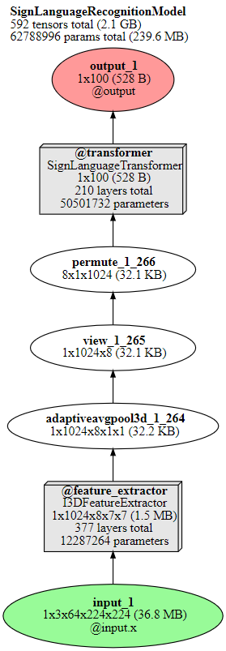

# Sign Language Recognition Using I3D and Transformers

This project implements a **sign language gesture recognition system** using a hybrid architecture that combines **Inflated 3D ConvNet (I3D)** and **Transformers** for spatiotemporal feature extraction and temporal modeling. The project is based on the **Word-Level American Sign Language (WLASL)** dataset and leverages advancements in deep learning to improve recognition accuracy for word-level ASL gestures. Please refer to the report for a detailed technical overview of this project.

---

## Introduction

This work builds upon the research and dataset provided in the **Word-Level Deep Sign Language Recognition** paper by Dongxu Li et al. (2020). The official repository containing all code and contributions for the baseline model can be found here:  
[WLASL Repository](https://github.com/dxli94/WLASL).

The goal of this project is to enhance the baseline results by integrating **I3D** as a feature extractor and **Transformer** for temporal modeling, achieving improved performance for word-level sign recognition tasks.

---

## Dataset

The project uses the **WLASL Dataset**:  
- A large-scale video dataset with **2000 vocabulary words** performed by **100+ signers**.  
- Contains over **21,000 videos**, split into subsets:
  - **WLASL100**: 100 words  
  - **WLASL300**: 300 words  
  - **WLASL500**: 500 words  
  - **WLASL1000**: 1000 words  
  - **WLASL2000**: 2000 words

### Dataset Preprocessing:
- Frames were extracted from videos using metadata to address class imbalance and multi-word sequences.
- Weighted Sampling and **Weighted Cross Entropy Loss** were applied to handle class imbalance.

---

## Architecture Diagram

---

## Methodology

The proposed model consists of a **hybrid architecture**:

1. **Input**: Video sequences with shape **(Batch, Channels, Frames, Height, Width)**.

2. **Feature Extraction - I3D**:
   - **I3D (Inflated 3D ConvNet)** extracts spatiotemporal features using **3D convolutions**.
   - Pretrained I3D weights are used, and layers are frozen to preserve spatiotemporal knowledge.

3. **Temporal Modeling - Transformer**:
   - Positional encodings are added to frame-level features.
   - A stack of **6 Transformer Encoder layers** models temporal dependencies:
     - **Multi-head Self-Attention** captures inter-frame relationships.
     - **Feedforward Layers** and normalization improve feature representations.
   - Mean pooling reduces the temporal dimension for classification.

4. **Output**:
   - Final predictions are generated as a probability distribution over **100 gesture classes**.

---

## Evaluation Metrics

The model is evaluated using the following metrics:
- **Top-1 Accuracy**: Exact match for predicted and true class.
- **Top-5 and Top-10 Accuracy**: True class is within top-5 or top-10 predictions.
- **Precision, Recall, and F1-Score**: Evaluates false positives/negatives for imbalanced classes.
- **Confusion Matrix**: Visualizes misclassification patterns.

---

## Results

The proposed model significantly outperformed the baseline methods:

| Model                     | Top-1 Accuracy | Top-5 Accuracy | Top-10 Accuracy |
|---------------------------|----------------|----------------|-----------------|
| **Baseline (WLASL)**      | 65.89%         | 84.11%         | 89.92%          |
| **Proposed (I3D+Transformer)** | 79.22%         | 88.00%         | 90.83%          |

---

## Training Configuration

- **Batch Size**: 12  
- **Epochs**: 50  
- **Optimizer**: Adam  
- **Learning Rate**: 0.001  
- **Frame Sampling**: 64 frames per video  
- **Regularization**: Dropout (0.2), Weight Decay  

### Training Insights:
- Validation loss exhibited fluctuations, indicating minor overfitting.
- The model achieved peak validation accuracy at **73.11%** by epoch 41.

---

## Future Scope

- Scale the model to the full **WLASL2000** dataset.
- Explore **Vision Transformers (ViTs)** for enhanced spatial-temporal modeling.
- Optimize the model for **real-time inference** with live video input.
- Improve memory efficiency with **model compression** techniques.

---

## References

1. Dongxu Li et al., "Word-Level Deep Sign Language Recognition from Video: A New Large-Scale Dataset and Methods Comparison" - [Baseline Paper](https://github.com/dxli94/WLASL)  
2. Carreira, J., & Zisserman, A., "Quo Vadis, Action Recognition? A New Model and the Kinetics Dataset", IEEE CVPR, 2017.  
3. Dosovitskiy et al., "An Image is Worth 16x16 Words: Transformers for Image Recognition at Scale", arXiv, 2020.  
